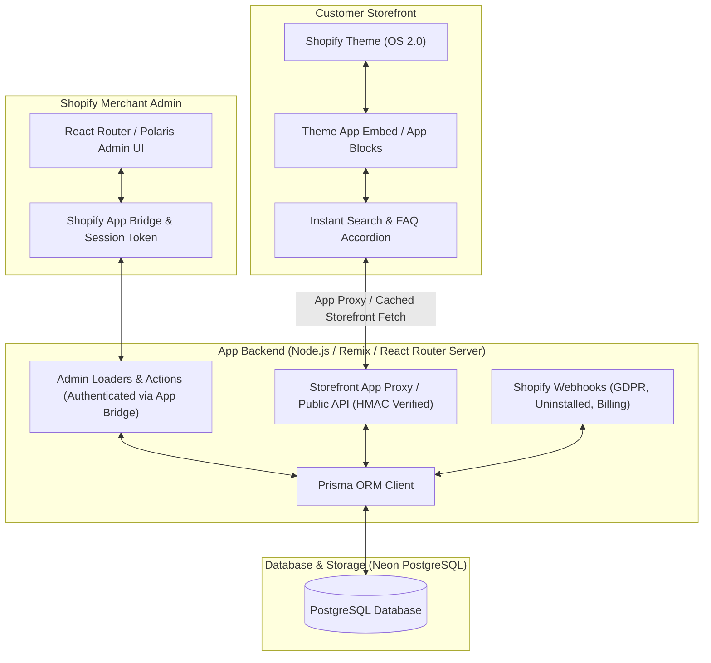
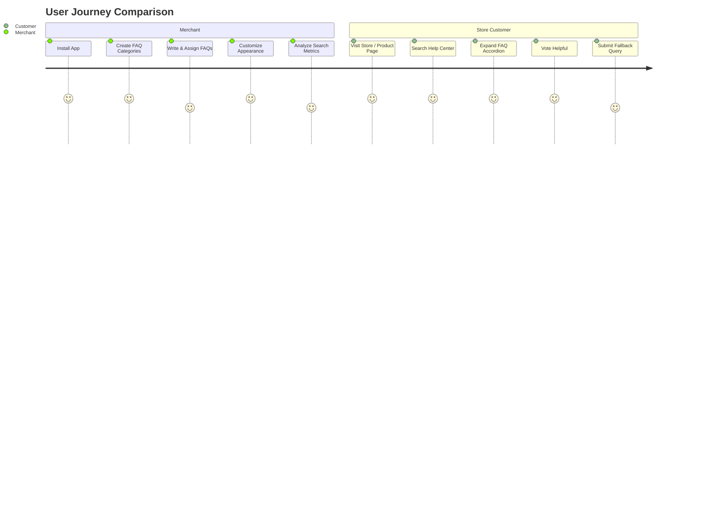
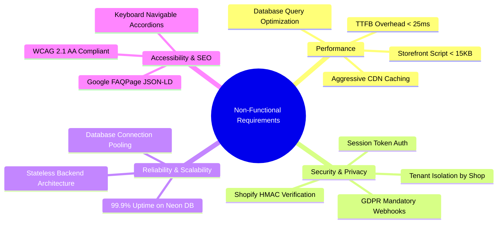
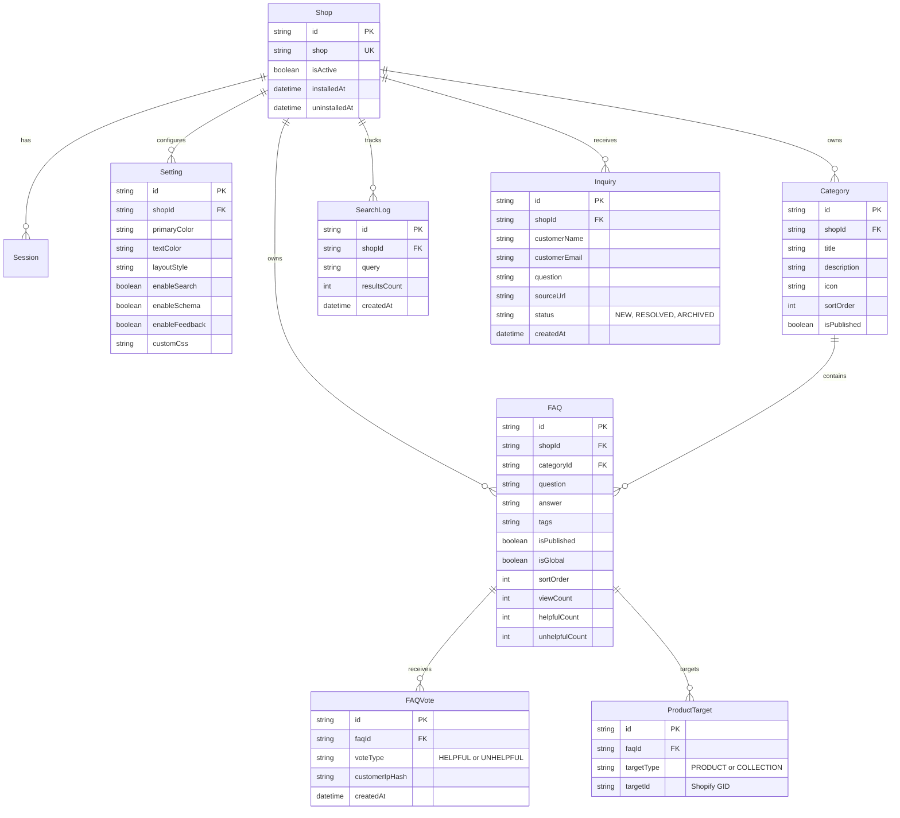

# Software Requirements Specification (SRS)
## Smart FAQ & Help Center — Shopify App

**Version:** 1.0.0  
**Status:** Approved for Architecture & Database Design  
**Date:** 2026-10-08  
**Author:** Product & Engineering Team (Shmart Solutions)  
**Technology Stack:** Shopify App Template (Remix / React Router 7), Shopify Polaris, Shopify App Bridge, Prisma ORM, PostgreSQL (Neon DB), Shopify Theme App Extensions (Liquid, Vanilla JS, CSS), App Proxy / REST / GraphQL APIs.

---

## 1. Introduction

### 1.1 Purpose
The purpose of this Software Requirements Specification (SRS) is to provide a complete, rigorous, and actionable description of the requirements for the **Smart FAQ & Help Center** Shopify App. This document serves as the single source of truth for database schema design, UI/UX architecture, backend API implementations, Storefront Theme Extensions, and quality assurance.

### 1.2 Product Scope & Vision
**Smart FAQ & Help Center** is a high-performance, multi-tenant Shopify application built for merchants ranging from small-to-medium stores to high-volume Shopify Plus enterprises. 

The app empowers merchants to:
1. Build comprehensive, organized, and searchable Help Centers and FAQ hubs without writing code.
2. Embed contextual product FAQs, category FAQs, and general store FAQs directly into Shopify Online Store 2.0 (OS 2.0) themes via Theme App Extensions.
3. Boost organic search traffic with automatic **Schema.org `FAQPage` JSON-LD structured data**.
4. Collect actionable customer feedback ("Was this helpful?"), track zero-result searches, and analyze customer pain points to drive conversion rates and reduce customer support ticket loads.
5. Provide a fallback "Ask a Question / Contact Us" form inside the FAQ widget to capture leads and resolve queries.

### 1.3 Definitions, Acronyms, and Abbreviations
| Term | Definition |
| :--- | :--- |
| **OS 2.0** | Shopify Online Store 2.0 Theme Architecture (JSON templates, App Blocks, App Embeds) |
| **Theme App Extension** | Shopify mechanism to inject merchant assets, Liquid, and scripts cleanly into themes without modifying theme code files |
| **App Proxy** | Shopify feature that routes storefront HTTP requests to the app's backend securely with verified HMAC signatures |
| **Polaris** | Shopify’s official design system and React component library for admin interfaces |
| **App Bridge** | Shopify library providing seamless integration and authentication between the embedded app and Shopify Admin |
| **JSON-LD / Schema** | Structured data format recognized by Google and search engines to display rich FAQ snippets in Search Engine Result Pages (SERPs) |
| **Multi-tenancy** | Architectural pattern where every database table and query isolates data strictly by `shop` domain |

---

## 2. System Architecture & High-Level Overview

### 2.1 System Architecture Diagram



### 2.2 System Components
1. **Merchant Admin Dashboard (Embedded):** Built with React Router 7 and Shopify Polaris. Allows merchants to configure categories, FAQs, visual styles, display rules, and review analytics.
2. **Backend Server:** Node.js with React Router 7 handling loaders/actions, secure authentication, GraphQL client interactions with Shopify Admin API, and Webhooks.
3. **Database Layer:** Prisma ORM connected to Neon PostgreSQL for scalable relational data storage.
4. **Storefront Theme App Extension (OS 2.0):**
   - **FAQ Page / Section App Block:** Full FAQ directory, category tabs, and accordion lists.
   - **Product Page FAQ App Block:** Contextual FAQs linked to individual products or collections.
   - **Floating Help Center Widget (App Embed):** Floating trigger button opening a slide-out drawer with search and FAQs.
5. **Storefront App Proxy / API Endpoints:** Handles real-time search, FAQ dynamic rendering, view increments, and "Helpful / Not Helpful" feedback votes.

---

## 3. User Personas & Roles



### 3.1 Personas
1. **Store Merchant / Admin:**
   - Wants fast, intuitive creation and reordering of FAQs.
   - Requires zero theme code edits.
   - Wants SEO benefits (Google Rich Snippets) out-of-the-box.
   - Demands deep customization to match their brand typography and color palette.
2. **Storefront Shopper / Customer:**
   - Needs instant answers to shipping, returns, sizing, and product-specific questions.
   - Expects lightning-fast instant search with typo-tolerance.
   - Wants smooth accordion transitions on mobile and desktop without layout shifts.
3. **Store Support Agent:**
   - Reviews customer feedback and unresolved search queries to identify missing FAQ content.

---

## 4. Functional Requirements

### 4.1 Module 1: FAQ Category & Group Management
- **FR-1.1 Category Hierarchy:** Support categorized grouping of FAQs (e.g., *Shipping & Delivery*, *Returns & Refunds*, *Payment Methods*, *Product Care*).
- **FR-1.2 Category Attributes:**
  - Category Title (e.g., "Shipping & Delivery")
  - Subtitle / Description (optional)
  - Icon selection (Pre-built SVG icon library or custom SVG/Image upload)
  - Visibility Status (`ACTIVE`, `DRAFT`, `ARCHIVED`)
  - Display Sort Order (integer index)
- **FR-1.3 Drag & Drop Reordering:** Intuitive drag-and-drop sorting of categories in the Admin UI.
- **FR-1.4 Category Collapsibility & Display Rules:** Option to display categories as Grid Cards, Sidebar Navigation, or Horizontal Tabs on the storefront.

### 4.2 Module 2: FAQ Content Management & Rich Editor
- **FR-2.1 FAQ Item Attributes:**
  - Question Title (String, required)
  - Answer Body (Rich Text / HTML / Markdown support: bold, italic, links, lists, images, embedded YouTube/Vimeo video embeds)
  - Category Association (Foreign key to Category)
  - Visibility Status (`PUBLISHED`, `DRAFT`, `SCHEDULED`)
  - Pinned / Featured Flag (Display at the top of the category or general page)
  - Display Sort Order (within the category)
- **FR-2.2 SEO & Structured Data Configuration:**
  - Toggle Schema.org `FAQPage` JSON-LD generation per FAQ / globally.
  - Custom Meta description generation for dedicated FAQ landing pages.
- **FR-2.3 Tags & Keywords:**
  - Merchant can assign hidden search tags/keywords to an FAQ to improve internal search discovery without altering the visible question text.

### 4.3 Module 3: Contextual FAQ Targeting & Assignment
- **FR-3.1 Global FAQs:** FAQs marked as global display across general Help Center pages and floating widgets.
- **FR-3.2 Product-Specific FAQs:**
  - Direct assignment to specific Shopify Products (via Shopify Resource Picker).
  - Conditional assignment to Collections (e.g., all items in "Apparel" show sizing FAQs).
  - Conditional assignment based on Product Tags or Product Types.
- **FR-3.3 Customer Segmentation (Future-ready):**
  - Optional visibility rules based on customer tag (e.g., B2B / Wholesale vs Retail).

### 4.4 Module 4: Storefront Theme App Extensions & UI Components
- **FR-4.1 App Block 1 — Dedicated FAQ Section / Page:**
  - Embeddable on any page template (e.g., `/pages/faq`, `/pages/help-center`).
  - Supports Multiple Layouts:
    - *Accordion Style* (single or multiple expandable items)
    - *Grid Layout* (Category cards leading to accordion lists)
    - *Side Navigation Layout* (Sticky categories on left, FAQs on right)
- **FR-4.2 App Block 2 — Product Page FAQ Tab / Accordion:**
  - Embeddable on `product.json` templates under product description, as collapsible rows, or inside product tabs.
  - Dynamically fetches and filters FAQs assigned specifically to the current product + global product FAQs.
- **FR-4.3 App Embed — Floating Help Center Widget:**
  - Toggleable floating button (bottom-left or bottom-right).
  - Modal / Slide-out drawer containing search bar, top categories, and expandable FAQs.
- **FR-4.4 SEO JSON-LD Microdata Injection:**
  - Auto-rendered `<script type="application/ld+json">` conforming strictly to Google's `FAQPage` specifications.

### 4.5 Module 5: Smart Search Engine
- **FR-5.1 Instant Live Search:**
  - Client-side search for instantaneous (<10ms) response on preloaded FAQ sets.
  - Fallback / Dynamic server search via App Proxy for large knowledge bases.
- **FR-5.2 Search Intelligence:**
  - Fuzzy matching & typo tolerance.
  - Multi-field matching across Question, Answer body, and hidden Tags.
  - Keyword highlighting in the search results UI.
- **FR-5.3 Zero-Result Handling:**
  - Friendly empty state with suggested popular FAQs or a "Contact Us / Ask a Question" CTA.

### 4.6 Module 6: Customer Feedback & Lead Capture
- **FR-6.1 Helpful Rating System:**
  - Storefront widget displays "Was this answer helpful? [👍 Yes] [👎 No]".
  - One vote per customer session / IP tracking to prevent duplicate spam votes.
  - Instant positive/negative count increment in database.
- **FR-6.2 Unresolved Question Form (Lead Capture):**
  - Configurable "Can't find your answer? Ask us directly" form.
  - Captures: Customer Name, Email, Subject, Question message, and Store Page URL.
  - Saves inquiries to database and sends notification email to merchant / webhook.

### 4.7 Module 7: Visual Customizer & Brand Settings
- **FR-7.1 Typography & Sizing:**
  - Inherit theme fonts or select custom web fonts.
  - Configurable font sizes for Questions, Answers, Category Headers, and Search Input.
- **FR-7.2 Color Scheme & Styling:**
  - Background color, text color, accent/brand color, active accordion color, hover states.
  - Corner radius (Sharp, Rounded, Pill).
  - Border width and border color.
  - Custom Accordion Icons (Plus/Minus, Chevron up/down, Arrow, Caret).
  - Animation speed (Smooth ease-in-out expansion).
- **FR-7.3 Custom CSS Editor:**
  - Secure custom CSS input box for advanced merchant brand matching.
- **FR-7.4 Live Preview in Admin:**
  - Real-time interactive preview canvas in the Polaris Admin UI showing changes before publishing.

### 4.8 Module 8: Analytics & Insights Dashboard
- **FR-8.1 Core Metrics:**
  - Total FAQ Views & Impressions.
  - Total Searches performed.
  - Overall Helpfulness Satisfaction Rate (`Helpful Votes / (Helpful + Unhelpful) * 100%`).
- **FR-8.2 Top & Bottom Performing FAQs:**
  - Table of most viewed FAQs.
  - FAQs with high "Not Helpful" votes to signal needed content revisions.
- **FR-8.3 Search Query Analytics:**
  - Top search terms entered by customers.
  - **Zero-Result Queries Report:** Lists queries where customers found no answers, pointing directly to missing content opportunities.

### 4.9 Module 9: Import, Export & Template Starter Packs
- **FR-9.1 CSV / JSON Import & Export:**
  - One-click bulk export of all categories, FAQs, and settings.
  - Bulk import with CSV template validation.
- **FR-9.2 Starter Templates (1-Click Install):**
  - Pre-written FAQ templates for popular eCommerce niches:
    - *Fashion & Apparel* (Sizing, Returns, Fabric care)
    - *Dropshipping / General Store* (Tracking, Delivery times, Order cancellations)
    - *Electronics & Gadgets* (Warranty, Tech specs, Troubleshooting)
    - *Beauty & Cosmetics* (Ingredients, Expiry, Safety)

---

## 5. Non-Functional Requirements (NFR)



### 5.1 Performance Requirements
1. **Storefront Script Footprint:** The storefront JavaScript bundle for the Theme App Extension must be **under 15KB gzipped** with zero external runtime dependencies (Vanilla JS).
2. **Page Load Impact:** Storefront rendering overhead must be less than 25ms to maintain top Google Core Web Vitals and Shopify Speed Scores.
3. **Database Efficiency:** All queries must be indexed on `shop_id` / `shop` and foreign keys to ensure query response time under 50ms under heavy load.

### 5.2 Security & Compliance
1. **Multi-Tenant Isolation:** Every read, write, and delete query must strictly filter by the authenticated `shop` domain.
2. **Authentication:** All admin routes must authenticate requests using Shopify App Bridge Session Tokens (`authenticate.admin(request)`).
3. **App Proxy Verification:** All storefront API requests routed via Shopify App Proxy must validate the `signature` HMAC parameter before processing.
4. **GDPR / Privacy Mandates:** The app must implement the 3 mandatory Shopify compliance webhooks:
   - `customers/data_request`
   - `customers/redact`
   - `shop/redact`
5. **App Uninstallation Cleanup:** Listening to `app/uninstalled` webhook to mark shop as uninstalled and handle soft-deletion or data retention lifecycle.

### 5.3 Reliability, Scalability & Availability
1. **Stateless Backend:** Server logic must be completely stateless to run seamlessly on modern containerized or serverless hosting (Vercel, Fly.io, Cloudflare, AWS).
2. **Database Pooling:** Neon PostgreSQL connection pooling (`@prisma/client` with pooled connection strings) to withstand burst traffic during BFCM and promotional sales.

### 5.4 Usability, Accessibility & SEO
1. **WCAG 2.1 AA Accessibility:** All storefront accordions must support keyboard navigation (`Tab`, `Enter`, `Space`) and proper ARIA attributes (`aria-expanded`, `aria-controls`, `role="region"`).
2. **SEO Compliance:** Automated generation of valid `FAQPage` JSON-LD schema without duplicate or invalid tag hierarchies.

---

## 6. External Interfaces & API Specifications

### 6.1 Shopify Admin Interfaces
- **Shopify Polaris (v12+):** Consistent UI components (`Page`, `Layout`, `Card`, `IndexTable`, `TextField`, `Modal`, `Banner`).
- **Shopify App Bridge React:** Navigation, Toast notifications, Modal popups, and Contextual Save Bar integration.

### 6.2 Storefront Interfaces (Theme App Extensions)
- **Directory Structure:**
  ```text
  extensions/
  └── theme-faq-extension/
      ├── shopify.extension.toml
      ├── blocks/
      │   ├── faq_page.liquid
      │   ├── faq_product_tab.liquid
      │   └── faq_schema.liquid
      ├── snippets/
      │   ├── faq_accordion_item.liquid
      │   └── faq_search_bar.liquid
      ├── assets/
      │   ├── faq-storefront.js
      │   └── faq-storefront.css
      └── locales/
          └── en.default.json
  ```

### 6.3 REST / App Proxy API Endpoints

| Method | Endpoint Route | Auth / Security | Description |
| :--- | :--- | :--- | :--- |
| `GET` | `/apps/faq-proxy/api/faqs` | Shopify Proxy HMAC | Fetches active FAQs for storefront rendering (cached) |
| `GET` | `/apps/faq-proxy/api/search` | Shopify Proxy HMAC | Live search endpoint for fuzzy querying |
| `POST`| `/apps/faq-proxy/api/vote` | Shopify Proxy HMAC + IP | Increments Helpful / Unhelpful count for an FAQ |
| `POST`| `/apps/faq-proxy/api/contact`| Shopify Proxy HMAC + Rate Limit | Submits customer unanswered question / inquiry |
| `GET` | `/api/admin/analytics` | Shopify App Bridge | Fetches merchant dashboard metrics and charts |
| `POST`| `/webhooks/*` | Shopify Webhook HMAC | Handles Shopify lifecycle webhooks |

---

## 7. Data Models & Entity Relationships (Prisma High-Level Design)

### 7.1 Entity Relationship Diagram



### 7.2 Entity Overview for Prisma Schema Design
1. **`Session`**: Shopify Session storage required by `@shopify/shopify-app-session-storage-prisma` (Already configured in PostgreSQL).
2. **`ShopSetting` / `AppConfig`**: Per-shop global configuration (branding, colors, layout mode, SEO toggles, contact form status).
3. **`FaqCategory`**: Organizes FAQs into logical groups with sort ordering, icon support, and visibility flags.
4. **`FaqItem`**: The core question & answer records, rich text, sort orders, and engagement counters.
5. **`FaqProductTarget`**: Junction relation mapping FAQs to specific Shopify Product IDs or Collection IDs.
6. **`FaqFeedback` / `FaqVote`**: Individual customer votes for helpfulness calculation and anti-spam hashing.
7. **`SearchLog`**: Search query history and zero-result search terms for analytics.
8. **`CustomerInquiry`**: Captured customer questions when the FAQ didn't answer their query.

---

## 8. User Stories & Acceptance Criteria

### 8.1 Merchant User Stories
- **US-1.1:** *As a merchant, I want to create and organize FAQ categories so that my customers can browse questions by topic.*
  - **Acceptance Criteria:** Merchant can create, rename, reorder via drag-and-drop, and toggle visibility of categories from the admin dashboard.
- **US-1.2:** *As a merchant, I want to link specific FAQs to particular products so that customers only see sizing and technical details relevant to the product they are viewing.*
  - **Acceptance Criteria:** Product Picker modal allows selecting 1 or more products/collections; the storefront product page only renders associated + global FAQs.
- **US-1.3:** *As a merchant, I want Google to display FAQ rich snippets in search results to boost organic CTR.*
  - **Acceptance Criteria:** The app injects valid `FAQPage` JSON-LD schema into the storefront DOM. Structured Data Testing Tool / Google Rich Results test validates with 0 errors.
- **US-1.4:** *As a merchant, I want to see which search queries return zero results so that I can write new FAQs for unmet customer questions.*
  - **Acceptance Criteria:** The Analytics tab displays a "Zero-Result Search Queries" table with frequency counts and a quick "Create FAQ" action button.

### 8.2 Customer User Stories
- **US-2.1:** *As a customer, I want to type keywords in a search box and see matching questions highlighted instantly.*
  - **Acceptance Criteria:** Search input filters questions in real-time (<50ms) with keyword match highlights.
- **US-2.2:** *As a customer, I want to click a question and have the answer expand smoothly on mobile without displacing other page elements.*
  - **Acceptance Criteria:** Accordions expand smoothly with CSS transitions, mobile responsive, and fully accessible via touch and keyboard.
- **US-2.3:** *As a customer, if my question isn't answered, I want to submit my question directly from the FAQ widget.*
  - **Acceptance Criteria:** The "Ask a Question" form validates email and message, displays a success message, and registers the inquiry in the merchant's dashboard.

---

## 9. Implementation Milestones & Roadmap

| Phase | Title | Deliverables & Focus |
| :--- | :--- | :--- |
| **Phase 1** | **Database & Schema Design** | Define complete Prisma models in `schema.prisma`, run migration / `db push` to Neon DB, seed starter templates. |
| **Phase 2** | **Merchant Admin CRUD** | Polaris UI for Category management, Rich FAQ editor, Product Picker targeting, and Drag & Drop sorting. |
| **Phase 3** | **Visual Customizer & Live Preview** | Settings page for colors, typography, accordion styles, custom CSS, with real-time interactive preview. |
| **Phase 4** | **Theme App Extension (OS 2.0)** | Liquid blocks for Section, Product Tab, and Floating App Embed with lightweight Vanilla JS & CSS. |
| **Phase 5** | **App Proxy APIs & Engagement** | Instant search engine, Helpfulness voting API, Inquiry submission, and Schema.org JSON-LD generation. |
| **Phase 6** | **Analytics & Reporting** | Search analytics, zero-result queries log, feedback metrics, and CSV import/export. |
| **Phase 7** | **Quality Assurance & Shopify App Store Ready** | Webhooks validation (GDPR, uninstalled), Core Web Vitals audit, automated test suite, App Store listing preparation. |

---

## 10. Approval & Sign-Off

| Role | Name / Title | Status | Date |
| :--- | :--- | :--- | :--- |
| **Lead Developer** | Antigravity AI / Rifat | Approved | 2026-10-08 |
| **Product Owner** | Rifat (Merchant & App Creator) | Ready for Database Modeling | 2026-10-08 |
